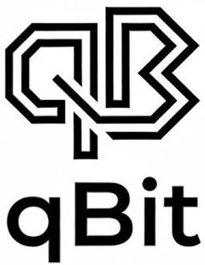
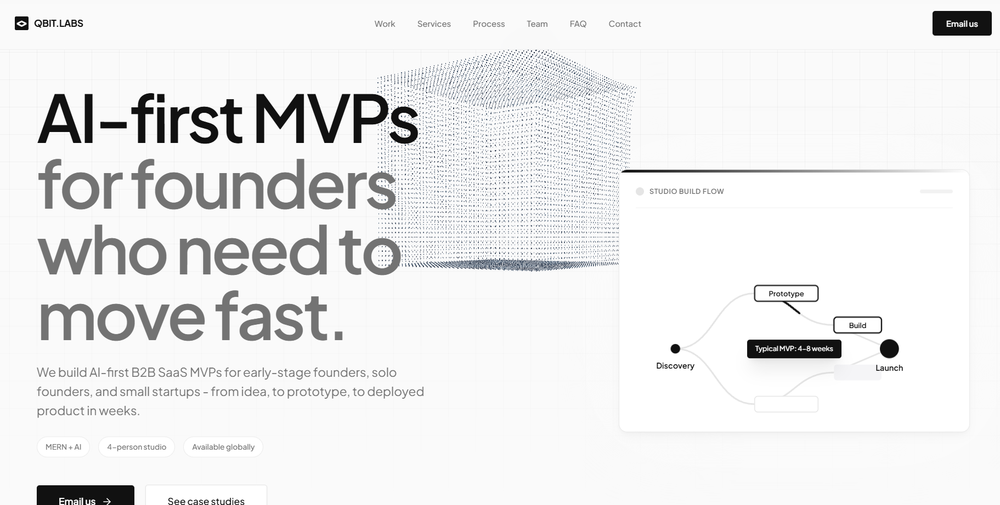
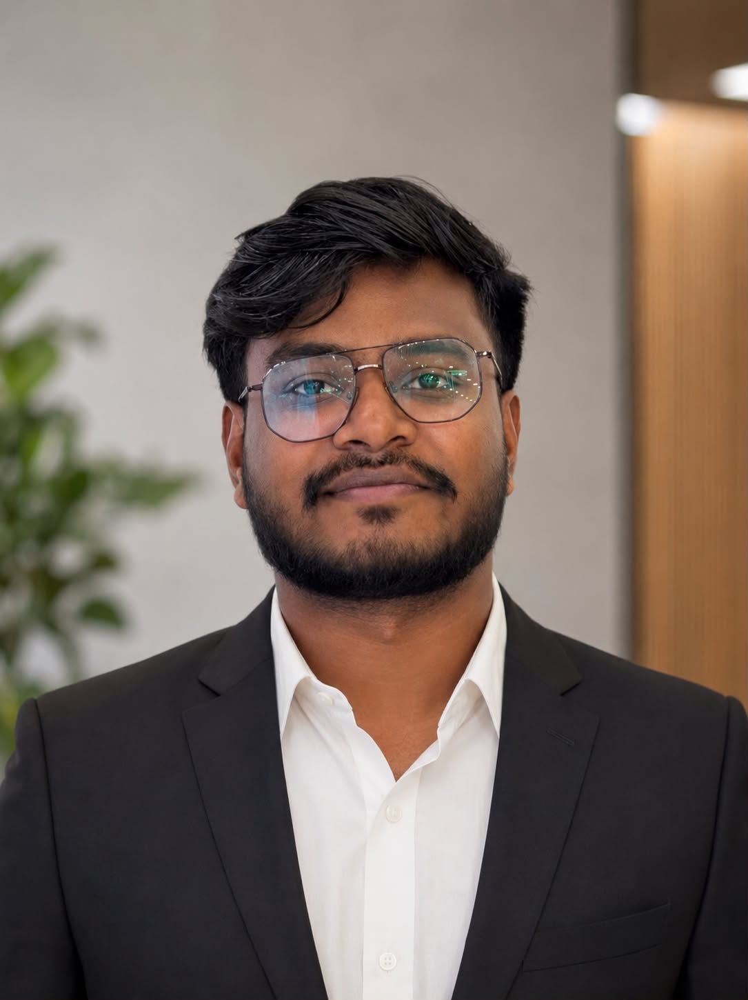
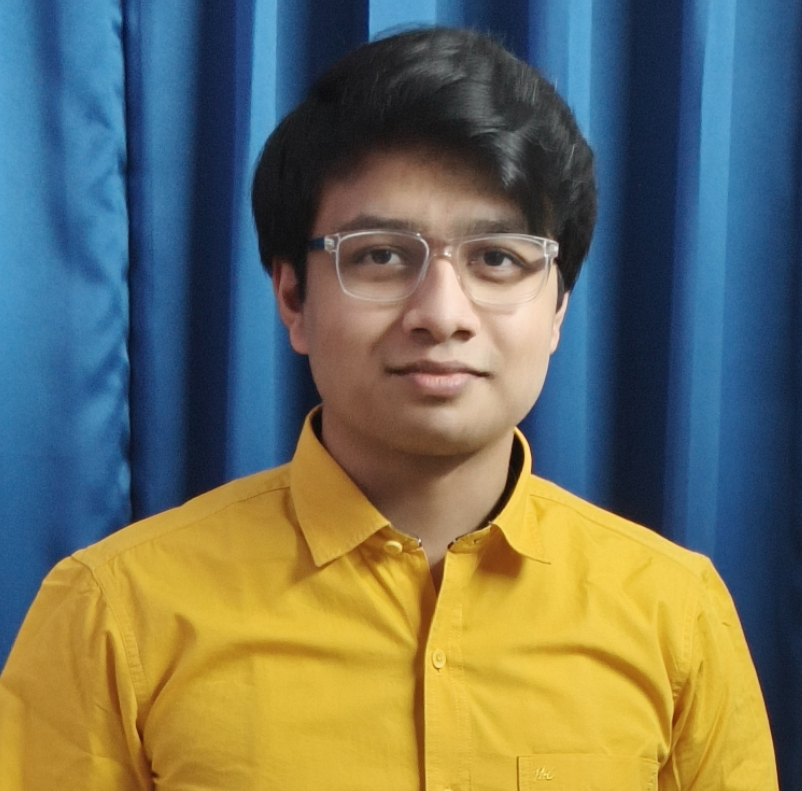
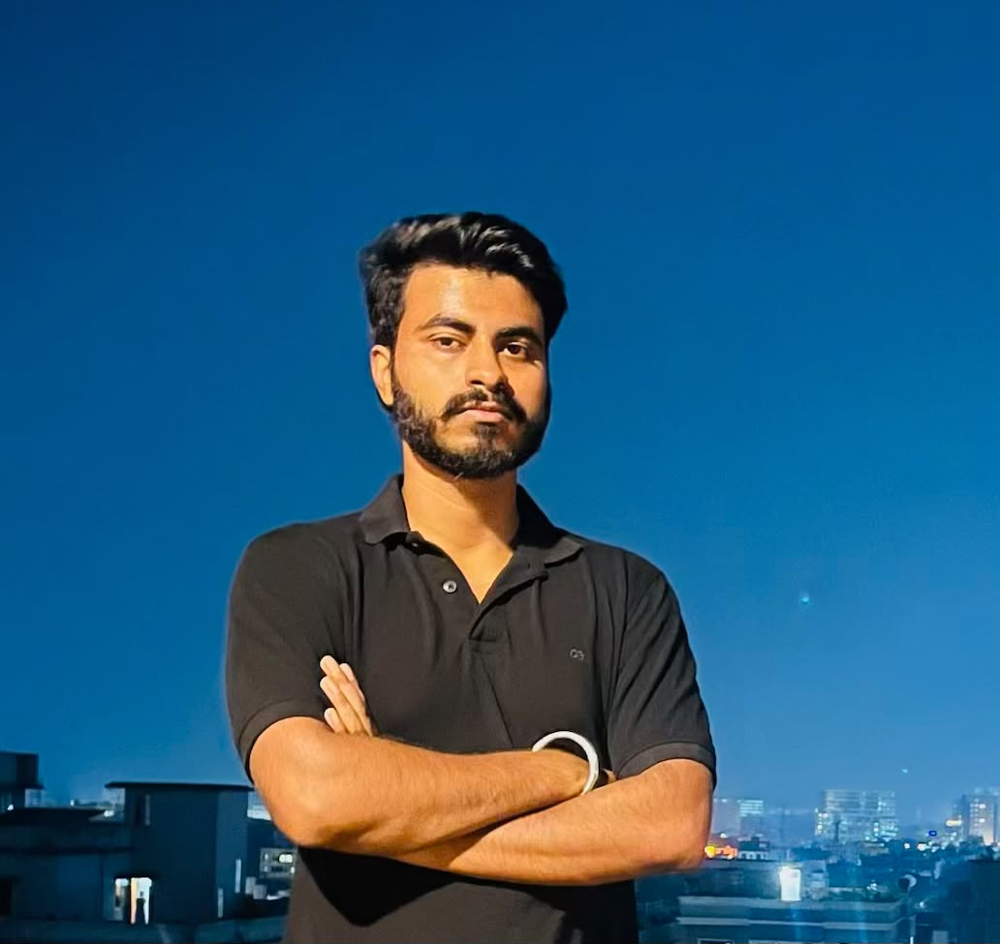

  

# 
Qbit Labs

### 
AI-First MVP Studio

  

---

  
  
  

  <a href="#-about">About</a> |
  <a href="#-stack">Tech Stack</a> |
  <a href="#-features">Features</a> |
  <a href="#-team">Team</a> |
  <a href="#-contact">Contact</a>

---

  

##  About

**Qbit Labs** is an AI-first MVP studio empowering early-stage founders, solo entrepreneurs, and small startups to rapidly transform ideas into deployable, AI-powered B2B SaaS products.

We specialize in shortening the path from concept to launched product — delivering **clarity**, **velocity**, and **deployable outcomes** through a focused, 4-person studio model.

📍 **Based in:** Mumbai, India  
🌐 **Serving:** Global founders

##  Team

| Name | Role |
|------|------|
|  | **Ayush Kumar** — Founder / AI Lead |
|  | **Bibek Gupta** — Technical Architect |
|  | **Pratim Pramanik** — ML Engineer |
|  | **Aditya Jyoti** — Product Lead |

---

##  Tech Stack

| Category | Technologies |
|----------|-------------|
| **Frontend** | HTML5, CSS3, JavaScript (ES6+), Tailwind CSS |
| **3D / Visuals** | Three.js, WebGL, Custom Shaders |
| **Icons** | Lucide Icons |
| **Typography** | Inter, JetBrains Mono, Plus Jakarta Sans |

---

##  Features

### Portfolio (`index.html`)
- 🚀 **Hero Section** with animated 3D node graph visualization
- 🎯 **Services Overview** — Discovery Sprint, Prototype MVP, Launch MVP
- 📋 **4-Step Studio Process** — Discovery → Wireframes → Weekly Builds → Launch
- 🏆 **Selected Work** — Case studies (FairCouncil, LexiRisk, Clarivo)
- 📊 **Pricing & Engagements** — Transparent pricing models
- ❓ **FAQ Accordion** — Common questions from founders
- 📬 **Contact Section** — Direct email + MVP teardown offer

### Team Page (`team.html`)
- 🎴 **Interactive 3D Card Stack** — Drag, swipe, and arrow-key navigation
- 🌟 **Animated Card Effects** — 3D tilt, glow rings, scanlines, and parallax
- 📋 **Member Profiles** — Name, designation, bio, and social links
- ⚡ **Scramble Text Animation** — Dynamic name/role reveal transitions
- 📱 **Fully Responsive** — Works seamlessly on desktop and mobile

### Visual & UX Highlights
- Technical background grids with subtle animations
- Ambient glowing blobs and depth effects
- Smooth scroll-behavior and cubic-bezier transitions
- Dark-mode aesthetic with high-contrast typography

---

##  Contact

📧 **Email:** [qbitlabs.studio@gmail.com](mailto:qbitlabs.studio@gmail.com)  
🔗 **Twitter / X:** [@buildqBit](https://x.com/buildqBit)  
📸 **Instagram:** [@buildqbit](https://instagram.com/buildqbit)

---

##  Quick Start

1. Open `index.html` in your browser to view the main website  
2. Navigate to the **Team** link to view `team.html`  
3. Click on team cards to explore individual profiles  
4. Use arrow keys or drag cards to navigate the stack  

> **Note:** Ensure images in the `images/` folder are accessible for team member avatars.

---

##  License

© 2026 Qbit Labs. All rights reserved.

---

  AI-first MVP development for founders who move fast.  
  

